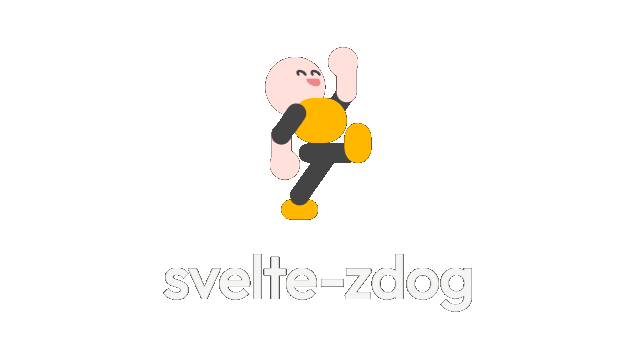

<div align="center">

[](https://carlos-aguilar.com/svelte-zdog)

[](https://npm.im/svelte-zdog)

svelte components for [zdog](https://zzz.dog) 3D renders

read [the docs](https://carlos-aguilar.com/svelte-zdog) for more info

## example

</div>

```svelte
<script>
  import { Illustration, Ellipse } from 'svelte-zdog'
</script>

<Illustration width={240} height={240} dragRotate>
  <Ellipse diameter={80} stroke={20} color="#ffb700" />
</Illustration>
```

<div align="center">

result:


## dev

🚧 dev server  
`npm run dev`

🏗 build site  
`npm run build`

📦 package  
`npm run package`

</div>
